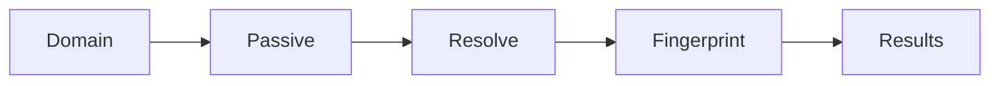

# subdomain-finder-utility 🔍🛰️

  

*Point it at a domain, walk away, come back to a mapped attack surface.*

---

## 🧭 Overview

**subdomain-finder-utility** is a standalone Windows enumeration tool that resolves the hidden edges of a domain — the forgotten staging servers, the dev subdomains nobody decommissioned, the API hosts leaking in certificate logs. Subdomain discovery is the first move in any serious reconnaissance workflow, and this utility compresses that entire process into a single double-click executable.

It exists because most subdomain finder tools are either browser-based (rate-limited, slow, leaky) or command-line scripts that demand a Python environment, a pile of dependencies, and patience. This project throws that model out. It's built for penetration testers, bug bounty hunters, security researchers, and IT administrators auditing their own infrastructure — anyone who needs a fast, offline-friendly, GUI-driven subdomain enumeration engine without wrestling with package managers.

The tool blends passive reconnaissance (certificate transparency, DNS records, public datasets) with active resolution, presenting results in a clean, sortable interface. No terminal required. No scripts to babysit.

<table>
<tr><th>Before</th><th>After</th></tr>
<tr><td>Juggling five browser tabs and CLI scripts</td><td>One executable, one input field</td></tr>
<tr><td>Manual DNS resolution checks</td><td>Automatic bulk resolution</td></tr>
<tr><td>Copy-pasting results into spreadsheets</td><td>Built-in export (CSV / TXT / JSON)</td></tr>
<tr><td>Rate-limited free web tools</td><td>Local engine, your own pace</td></tr>
<tr><td>No idea which subdomains are alive</td><td>Live/dead status per host</td></tr>
</table>

  

---

## ⚡ What It Actually Does

- **Passive scraping** — pulls subdomains from certificate transparency logs and public DNS aggregators without ever touching the target's servers.

- **Active resolution** — takes every candidate hostname and verifies it against live DNS, flagging dead entries instantly.

- **Wildcard detection** — sniffs out wildcard DNS configurations before they flood your results with false positives.

- **Bulk domain queue** — load a list of root domains and let the utility chew through them sequentially, no babysitting required.

- **Export pipeline** — one click to CSV, TXT, or JSON, formatted for import into other recon tooling.

- **Response fingerprinting** — captures HTTP status codes and titles for discovered hosts, so you know what's alive vs. what's a dangling record.

- **Rate-aware querying** — built-in throttling avoids tripping upstream provider limits during large scans.

- **Session persistence** — pause a scan, close the app, resume later without losing progress.

> [!TIP]
> Run passive-only mode first on unfamiliar targets — it's silent, fast, and gives you a baseline before you spend time on active resolution.

---

## 🚀 Getting Started

1. Visit the landing page via the **GET STARTED** button above.

2. Download the latest Windows build (single `.exe`, no installer wizard).

3. Launch it — Windows SmartScreen may prompt once; click **More info → Run anyway**.

4. Enter a root domain, pick your scan mode, hit **Start**.

> [!NOTE]
> First run creates a local config folder for saved settings and scan history. Nothing is sent anywhere without you triggering an export.

---

<strong>🖥️ System Requirements & Compatibility</strong>

 

| Requirement | Spec |
|---|---|
| OS | Windows 10 (64-bit) or Windows 11 |
| RAM | 2 GB minimum, 4 GB recommended for bulk domain queues |
| Disk | ~80 MB |
| Dependencies | **None** — fully self-contained executable |
| Network | Outbound internet access required for resolution |
| .NET / Runtime | Bundled internally, nothing to install separately |

  

> [!IMPORTANT]
> No admin rights needed for standard scans. Elevated permissions are only relevant if you enable low-level network diagnostics in advanced settings.

---

## 🧩 How It Works

1. **Input** — you supply a root domain (or a batch file of domains).

2. **Passive sweep** — the engine queries certificate transparency logs and public DNS datasets for candidate subdomains.

3. **Active resolution** — every candidate gets a live DNS lookup to confirm it actually resolves.

4. **Fingerprinting** — alive hosts get an HTTP probe for status code and page title.

5. **Output** — results land in the results grid, ready to sort, filter, or export.

---

<strong>🛠️ Troubleshooting</strong>

 

**Q: Scan finishes instantly with zero results — is the domain broken?**
A: More likely a typo or a domain with no public certificate history. Try switching to active-only mode to force raw DNS brute-forcing.

**Q: Windows Defender flagged the executable.**
A: Common with unsigned indie tools that perform network scanning. Verify the download hash on the landing page, then whitelist the executable.

**Q: Results show subdomains that don't actually exist.**
A: Classic wildcard DNS symptom. Enable **Wildcard Filter** in Settings — it detects catch-all DNS responses and strips the noise.

**Q: The app seems frozen during a large batch scan.**
A: It isn't — bulk queues on slow networks can take minutes per domain. Check the progress bar in the status strip at the bottom.

**Q: Export file is empty.**
A: You exported before the scan finished. Wait for the "Scan Complete" banner before triggering export.

**Q: Can I scan domains I don't own?**
A: Only with explicit authorization. Unauthorized reconnaissance may violate local law or terms of service — see Disclaimer below.

---

<strong>🎨 Interface, Shortcuts & Personalization</strong>

 

| Shortcut | Action |
|---|---|
| `Ctrl + N` | New scan |
| `Ctrl + S` | Save current results |
| `Ctrl + E` | Export dialog |
| `Ctrl + F` | Filter results table |
| `F5` | Re-run last scan |
| `Esc` | Cancel active scan |

**Themes:** Light, Dark, and a high-contrast "Terminal" mode for long recon sessions.

**Settings panel covers:**

- Concurrent thread count for resolution

- DNS resolver selection (system default or custom)

- Auto-export on scan completion

- Result table column visibility

> [!TIP]
> Dark mode plus the Terminal theme reduces eye strain during multi-hour bulk scans — flip it in Settings → Appearance.

---

## 🤝 Contributing & Community

Bug reports, feature requests, and pull requests are welcome via GitHub Issues. Before submitting:

- Search existing issues to avoid duplicates.

- Include your Windows build number and scan mode used.

- For feature requests, describe the recon workflow it improves.

> [!WARNING]
> Pull requests touching the resolution engine must include before/after benchmark numbers — performance regressions get rejected.

 

---

## 📄 License

Released under the [MIT License](LICENSE), 2026.

---

## ⚠️ Disclaimer

> This tool is built for authorized security research, penetration testing engagements, and infrastructure audits performed with proper permission. Running subdomain enumeration against domains you do not own or lack explicit authorization to test may violate laws or terms of service. The maintainers assume no liability for misuse.

---

  

